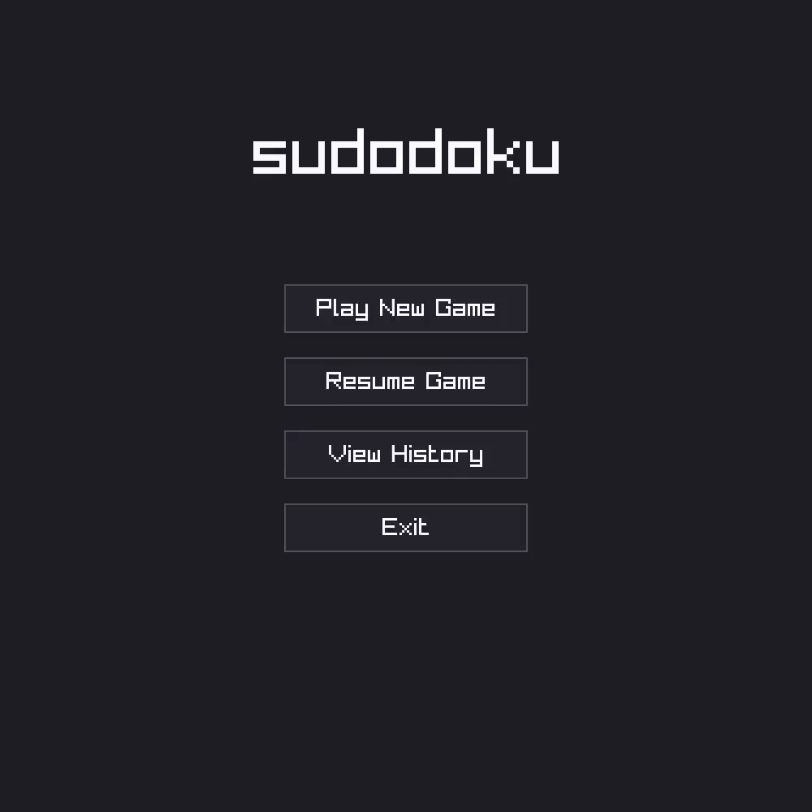

# sudodoku

A minimal sudoku client written using raylib

<p align="center">
  
</p>

## Keybinds
- **Arrow Keys / WASD**: Move selection
- **1-9**: Enter number
- **Shift + 1-9**: Toggle pencil mark (candidate)
- **0**: Clear cell
- **P**: Pause / Unpause game

## CLI Usage
```bash
sudodoku play <difficulty> [index]     # Play a puzzle (easy, medium, hard)
sudodoku list [easy|medium|hard]       # List unsolved puzzles
sudodoku add <puzzle> <difficulty>     # Add a new 81-character puzzle string
sudodoku history                       # View solve history
sudodoku status                        # View puzzle statistics
```
